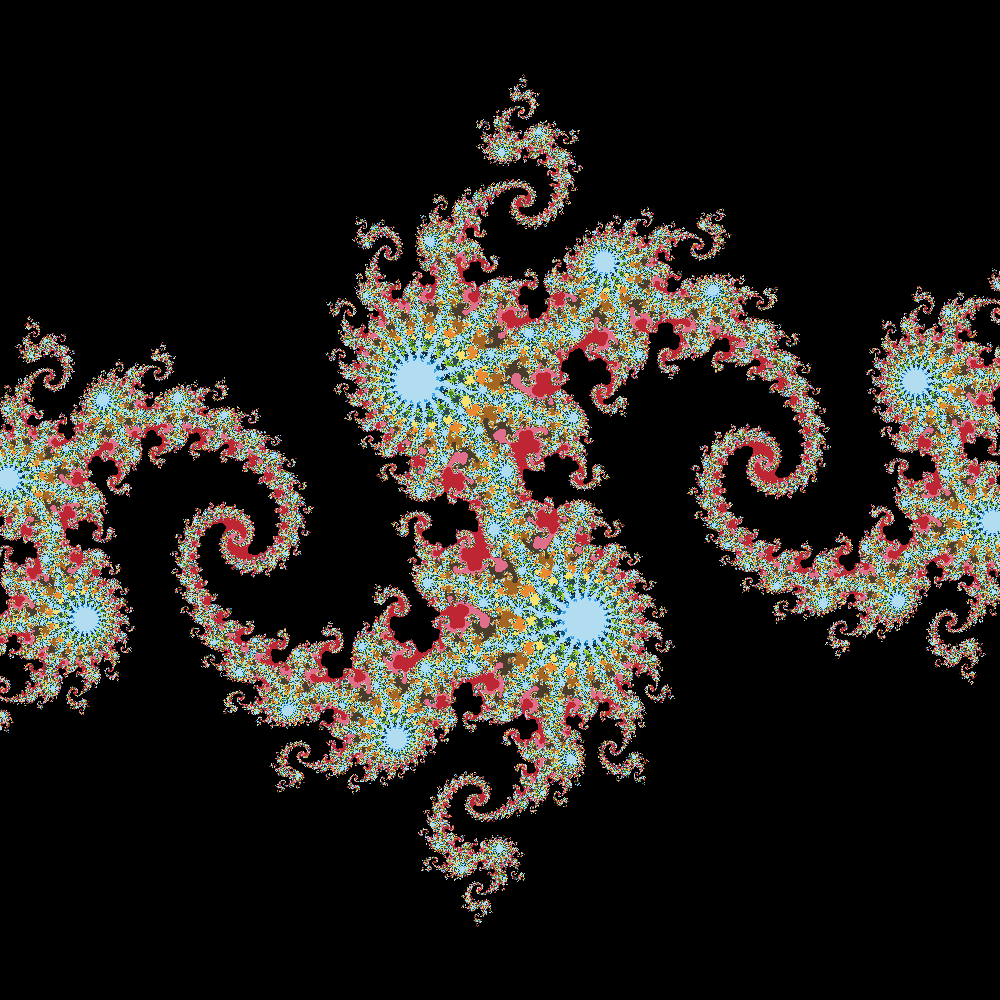

# Julia set generator

Quick and dirty Julia set (and mandelbrot) generator. A bit rough around the edges as I only made this to test out different approaches to parallelisation out, soon will have some time on a Xeon Phi cluster and want to make the most of it.

* Single threaded
* Multiple static pthreads
* OpenMP static for parallelisation
* WIP openCL.
* CUDA implementation is done awaiting hardware.

So far the pthreads version has been most consistantly fastest, openMP was by far the simplest to do requiring only about 2 lines of changes to code. Autopar versions provide only a modest improvement compared to single thread version. CUDA/openCL **should** be fastest on any modern GPU with openCL being portable to CPU/GPU.

Using GCC-7 and Graphite the autopar options make about 30% speed improvement to the mp version (obvious no -fopenmp).

Running time is linear with WIDTH, HEIGHT and ITERATIONS.

In order of performance, with vague hand-wavey figures:

* 6s for pthread
* 6.5s for openMP
* 18s for autopar
* 26s for single thread

## Theory

We look at complex quadratic polynomials of the form F(z) = z^2 + c where z is a complex parameter and c is a complex constant.

For Julia we use pick a constant c and create an image of where (x, y) are the real and iamginary parts of z, the pixel is coloured based on where interation of F(z) seems bound (the magnetude of z is less than THRESH after ITERATIONS iterations).

For Mandelbrot we set z = 0 and (x, y) become the real and imaginary parts of C again we look for the iterations to blow up.

## Sample output

### Julia

Default is F(z) = z -0.8 + 0.156i (suggested on wikipedia and CUDA by example).


With 16 colours



With 256 colours


### Mandelbrot


With 16 colour palette


With 256 random colours


## Compilation

```
$ gcc -O3 -o julia julia.c -lm -lpthread
$ gcc -O3 -o mandelbrot mandelbrot.c -lm -lpthread
```

For the openMP version julia-mp.c

```
$ gcc -O3 -o julia-mp src/julia-mp.c -lm -fopenmp
```

It's exceptionally multithreadable as you can calculate each pixel independently. By default it creates 12 threads. Most settings can only and should be set in the code, on my aging i5 laptop even having command line scaling (a single FP calulation per pixel) adds 10% overhead on some settings...

The python version is of course rather slow since it does no threading.

Make sure to update all files for height and width if you use them otherwise you will end up with tearing in the output.

Colors are set in data2img.sh in the sed command.

## Dependencies

* pthread (or openMP, there is also one without threading)
* getopt
* imagemagick or python with PIL


## Usage

Both are setup to produce images at default settings, in terms of tinkering this is usually with C in julia and SCALE in mandelbrot.

### Mandelbrot

```
$ ./bin/mandelbrot
$ ./bin/data2img.sh julia
$ eog julia.png
```

### Julia

For the pthread version julia.c

```
$ ./bin/julia
$ ./bin/jd2png.py
$ eog julia.png
```

For the python version

```
$ ./bin/julia.py
```

### Todo/Interesting things

* Currently they produce binary images one colour for well behaved over iterations and one for diverges. Why not produce many colors? Minimal modification for up to 0xFF colours, should produce very pretty images.

#### References and Reading

* https://developer.nvidia.com/cuda-example
* https://en.wikipedia.org/wiki/Julia_set
* https://en.wikipedia.org/wiki/Mandelbrot_set
